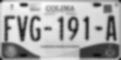

# Proyecto Vision - Semana Tec


---
## SETUP C++

The program in C++ lets you choose from a selected group of convolutions which one to apply to a certain image. 

### 1. Go to build folder and compile project 
```bash
cd build
make 
```

### 2. Run executable file 
```bash
./SemanaTec_Vision
```

## Results
### Original Image 


### Gauss Filter


### Sharpening 


### Laplacian 


---
## SETUP Python

Python is being used for a license plate recognition algorithm which leverages an specific Optic Character Recongition (OCR) engine to identify the serial number ID within a variety of images. In this case, for simplicity I opted for going with Tesseract from Google. 

### 1. Clone this repository

``` bash
git clone https://github.com/username/SemanaTec_Vision.git
cd SemanaTec_Vision
```

### 2. Set up python venv
This will be used to isolate python for this specific project.

```bash
python3 -m venv myenv 
source myenv/bin/activate
```

### 3. Install requirements.txt
```bash
pip install -r requirements.txt
```

### 4. Run PlateDetector.py
```bash
python PlateDetector.py
```

## Results Tesseract OCR
### 1. Apply Gaussian Blur
To filter out small letters and focus on regions of interest. 



### 2. Apply Canny Edge Detection
To highlight borders of the relevant characters. 


### 3. OCR Evaluation
Tesseract's output. (Some limitations in accuracy)

```bash
Recognized Text:
EVG- 191-1
```

